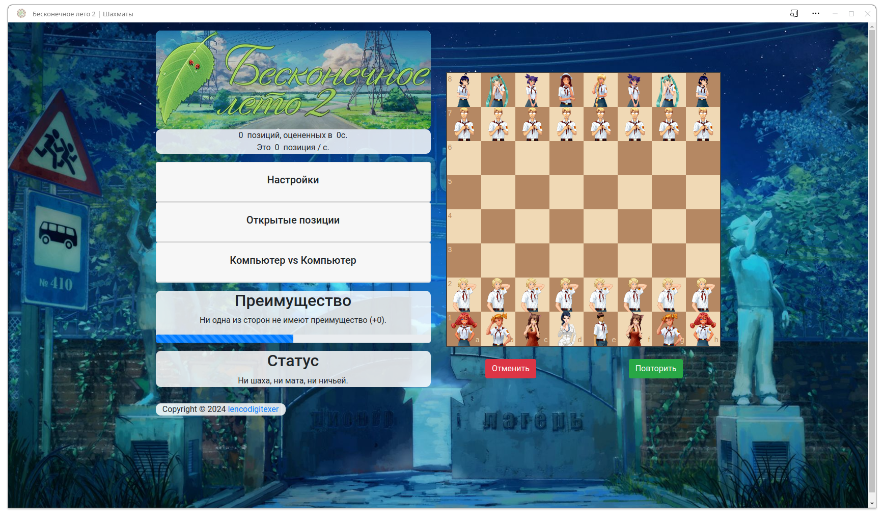

# Everlasting summer 2

Сыграйте в Бесконечное лето 2 | Шахматная доска с фигурами из персонажей визуальной новеллы Бесконечное лето

## О программе

Используется библиотека chess-ai - это простой шахматный ИИ на JavaScript.

Основной задачей chess-ai является принятие решений в приложении. Вся функциональность, выходящая за рамки ИИ, реализована с помощью внешних библиотек:

- Chessboard GUI: Использование API chessboard.js
- Игровая механика: API chess.js

ИИ использует [минимаксный алгоритм](https://en.wikipedia.org/wiki/Minimax), который оптимизируется с помощью [альфа-бета обрезки](https://en.wikipedia.org/wiki/Alpha%E2%80%93beta_pruning).

Функция оценки использует [таблицы квадратов фигур](https://www.chessprogramming.org/Piece-Square_Tables), адаптированные из Sunfish.py, и устраняет необходимость во вложенных циклах, обновляя сумму на основе каждого хода вместо повторного вычисления суммы отдельных фигур в каждом узле листа.

Глобальная сумма используется для отслеживания оценки черных после каждого хода, которая используется для отображения полосы "преимущества".

## Как играть?

1. Перейдите на сайт <https://lencodigitexer.github.io/everlasting-summer-2/>.

2. Играйте за белых, перетаскивая фигуру в нужное место. ИИ играет черными. Глубину минимаксного поиска ИИ (которая напрямую связана с тем, насколько хорошо он будет играть) можно настроить с помощью выпадающего параметра "Глубина поиска (черные)". Использование более высокого значения повысит точность ИИ, но ему потребуется больше времени для принятия решения о следующем ходе.

3. Чтобы сразить ИИ с самим собой, нажмите кнопку "Начать игру" в разделе "Компьютер против компьютера". Вы можете остановить игру в любой момент с помощью кнопки "Остановить и сбросить".

## Лицензия

Использование этой программы [MIT License](LICENSE).
